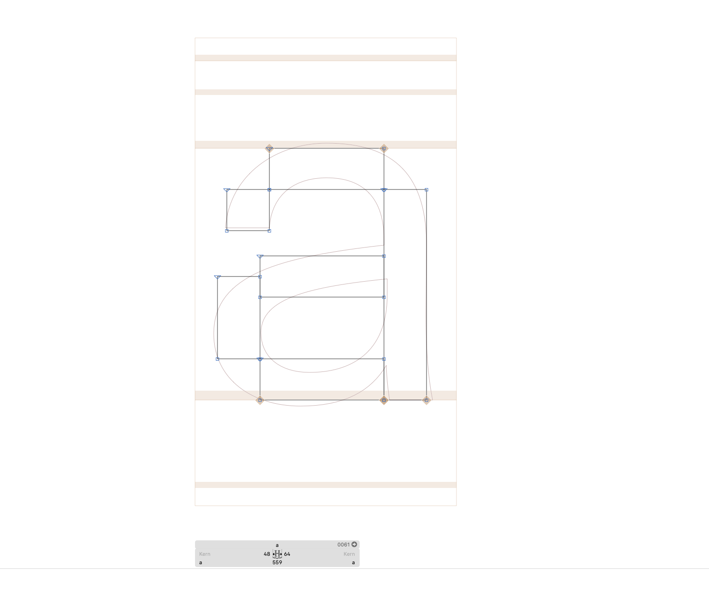

# Parsons MPS website typeface
This is the typeface for the Parsons MPS program website.

## Concept
When designing the program website, we wanted the concept and design to reflect principles that are innate to interactive media.

For example, typography in this context can change while in use (as on the website), or through continuous improvement (as new people contribute).

Therefore, we set out to design a display typeface that would reflect the values of change, evolution, expression, experimentation, etc. rather than a ‘perfect’ finished end-state. It allows for many ideas, concepts, and authors.

## License
We decided to open the typeface to contributions in the hopes that students in the MPS program (and others) would add to, edit, and thereby improve the typeface as the program also evolves. New versions can be incorporated into the website or used for other projects.

To contribute, branch and edit the Glyphs file, and submit a pull request.

## Design
Since MPS Sans is used interchangeably with the website’s primary typeface ([Suisse](https://www.swisstypefaces.com/fonts/suisse/) Int’l), we decided to keep the overall metrics the same as Suisse.

When designing, it’s best to keep the side-bearings the same as  Suisse (keeping in mind that the design should also work with this pre-defined sidebearing). This allows us to avoid re-spacing and kerning the entire typeface, or impacting the spacing when a glyph from MPS Sans sits next to a glyph from Suisse. For example, this is the MPS Sans **a** with Suisse in the background layer.

## Usage
Because of the project parameters and intention, this typeface is intentionally incomplete (missing glyphs, only basic spacing, etc.). It was designed to be paired with a ‘default’ typeface, using JavaScript to replace random characters with the MPS typeface. There are two sub-families in the Glyphs file: Pixel and Expressive.

To contribute:
1. Clone this repo (it’s best to use Commit Glyphs)
1. Open `MPS-Sans.glyphs` in Glyphs
3. Add your designs
4. Create a pull request
5. Add your name to the list of contributors

So, to use this typeface yourself, you will need to:
- pair it with another typeface with similar metrics (or design all the remaining glyphs)
- write a program that will replace individual glyphs in your website

## Contributors
- [Jacob Heftmann](https://www.jacobheftmann.com/)
- [Quentin Creuzet](https://www.quentincreuzet.fr/)